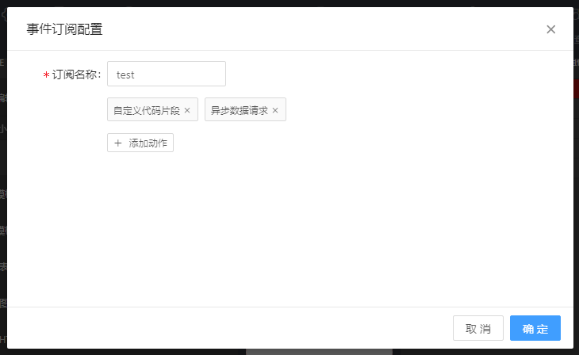

# 事件订阅/发布

订阅者把自己想订阅的事件注册到调度中心，当该事件触发时候，发布者发布该事件到调度中心，由调度中心统一调度订阅者注册的动作。

### 1. 事件订阅 
如同事件定义功能，订阅事件可以手动设置，执行的动作类型也一致。

<div style="width:100%; text-align: center">
  
  <p>图1-1 订阅事件</p>
</div>

为订阅的事件命名，并添加需要执行的动作。

<div style="width:100%; text-align: center">
  
  <p>图1-2 事件订阅配置</p>
</div>


### 2. 事件发布 

在需要发布事件的组件上添加动作，并附带想要传递的数据（也可以不传）。
```js
  this.emit('事件名称', {
  	data: '想要传递的数据'
  });  
```
举例说明应用场景：在切换业务线的时候触发订阅的事件，如下图，为下拉选择器组件添加 onSelect 事件。

<div style="width:100%; text-align: center">
  
  <p>图2-1 定义触发订阅事件的时机</p>
</div>

利用自定义代码触发事件

<div style="width:100%; text-align: center">
  
  <p>图2-2 触发事件</p>
</div>
